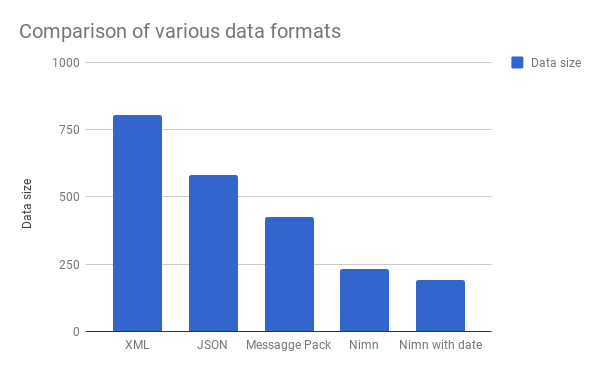

# spec
This repository is to give you more detail about Nimn data format. Please read [Specification](/SPEC.md) for more detail.

## About
Nimn (निम्न) word is taken from Sanskrit language.

When we communicate between servers or clients, half of the bandwidth is utilized by metadata. *Nimn data is dense form of data where field level information is kept separate from actual data.*  In brief, it can be understood as **schema aware compressed** form.

### MIME type

TODO: update it as soon as confirmed

### Comparision with other forms of data representation



#### XML (806 bytes)
```xml
<any_name>
    <person>
        <phone>+122233344550</phone>
        <name>Jack</name>
        <phone>+122233344551</phone>
        <age>33</age>
        <married>Yes</married>
        <birthday>Wed, 28 Mar 1979 12:13:14 +0300</birthday>
        <address>
            <city>New York</city>
            <street>Park Ave</street>
            <buildingNo>1</buildingNo>
            <flatNo>1</flatNo>
        </address>
        <address>
            <city>Boston</city>
            <street>Centre St</street>
            <buildingNo>33</buildingNo>
            <flatNo>24</flatNo>
        </address>
    </person>
    <person>
        <phone>+122233344553</phone>
        <name>Boris</name>
        <phone>+122233344554</phone>
        <age>34</age>
        <married>Yes</married>
        <birthday>Mon, 31 Aug 1970 02:03:04 +0300</birthday>
        <address>
            <city>Moscow</city>
            <street>Kahovka</street>
            <buildingNo>1</buildingNo>
            <flatNo>2</flatNo>
        </address>
        <address>
            <city>Tula</city>
            <street>Lenina</street>
            <buildingNo>3</buildingNo>
            <flatNo>78</flatNo>
        </address>
    </person>
</any_name>
```

#### JSON (580 bytes)
```json
{
    "any_name": {
        "person": [
            {
                "phone": [
                    122233344550,
                    122233344551
                ],
                "name": "Jack",
                "age": 33,
                "married": "Yes",
                "birthday": "Wed, 28 Mar 1979 12:13:14 +0300",
                "address": [
                    {
                        "city": "New York",
                        "street": "Park Ave",
                        "buildingNo": 1,
                        "flatNo": 1
                    },
                    {
                        "city": "Boston",
                        "street": "Centre St",
                        "buildingNo": 33,
                        "flatNo": 24
                    }
                ]
            },
            {
                "phone": [
                    122233344553,
                    122233344554
                ],
                "name": "Boris",
                "age": 34,
                "married": "Yes",
                "birthday": "Mon, 31 Aug 1970 02:03:04 +0300",
                "address": [
                    {
                        "city": "Moscow",
                        "street": "Kahovka",
                        "buildingNo": 1,
                        "flatNo": 2
                    },
                    {
                        "city": "Tula",
                        "street": "Lenina",
                        "buildingNo": 3,
                        "flatNo": 78
                    }
                ]
            }
        ]
    }
}
```

#### MESSAGE PACK (426 bytes)
```
81 a8 61 6e 79 5f 6e 61 6d 65 81 a6 70 65 72 73 6f 6e 92 86 a5 70 68 6f 6e 65 92 cf 00 00 00 1c 75 ac d2 26 cf 00 00 00 1c 75 ac d2 27 a4 6e 61 6d 65 a4 4a 61 63 6b a3 61 67 65 21 a7 6d 61 72 72 69 65 64 a3 59 65 73 a8 62 69 72 74 68 64 61 79 bf 57 65 64 2c 20 32 38 20 4d 61 72 20 31 39 37 39 20 31 32 3a 31 33 3a 31 34 20 2b 30 33 30 30 a7 61 64 64 72 65 73 73 92 84 a4 63 69 74 79 a8 4e 65 77 20 59 6f 72 6b a6 73 74 72 65 65 74 a8 50 61 72 6b 20 41 76 65 aa 62 75 69 6c 64 69 6e 67 4e 6f 01 a6 66 6c 61 74 4e 6f 01 84 a4 63 69 74 79 a6 42 6f 73 74 6f 6e a6 73 74 72 65 65 74 a9 43 65 6e 74 72 65 20 53 74 aa 62 75 69 6c 64 69 6e 67 4e 6f 21 a6 66 6c 61 74 4e 6f 18 86 a5 70 68 6f 6e 65 92 cf 00 00 00 1c 75 ac d2 29 cf 00 00 00 1c 75 ac d2 2a a4 6e 61 6d 65 a5 42 6f 72 69 73 a3 61 67 65 22 a7 6d 61 72 72 69 65 64 a3 59 65 73 a8 62 69 72 74 68 64 61 79 bf 4d 6f 6e 2c 20 33 31 20 41 75 67 20 31 39 37 30 20 30 32 3a 30 33 3a 30 34 20 2b 30 33 30 30 a7 61 64 64 72 65 73 73 92 84 a4 63 69 74 79 a6 4d 6f 73 63 6f 77 a6 73 74 72 65 65 74 a7 4b 61 68 6f 76 6b 61 aa 62 75 69 6c 64 69 6e 67 4e 6f 01 a6 66 6c 61 74 4e 6f 02 84 a4 63 69 74 79 a4 54 75 6c 61 a6 73 74 72 65 65 74 a6 4c 65 6e 69 6e 61 aa 62 75 69 6c 64 69 6e 67 4e 6f 03 a6 66 6c 61 74 4e 6f 4e
```
or
```
��any_name��person���phone��u��&�u��'�name�Jack�age!�married�Yes�birthday�Wed, 28 Mar 1979 12:13:14 +0300�address���city�New York�street�Park Ave�buildingNo�flatNo��city�Boston�street�Centre St�buildingNo!�flatNo��phone��u��)�u��*�name�Boris�age"�married�Yes�birthday�Mon, 31 Aug 1970 02:03:04 +0300�address���city�Moscow�street�Kahovka�buildingNo�flatNo��city�Tula�street�Lenina�buildingNo�flatNoN
```
#### NIMN (232 bytes)
```
ÆÆÇÆÇ122233344550º122233344551ÅJackº33ºYesºWed, 28 Mar 1979 12:13:14 +0300ÇÆNew YorkºPark Aveº1º1ÆBostonºCentre Stº33º24ÅÆÇ122233344553º122233344554ÅBorisº34ºYesºMon, 31 Aug 1970 02:03:04 +0300ÇÆMoscowºKahovkaº1º2ÆTulaºLeninaº3º78ÅÅ
```
#### NIMN with date compression (190 bytes)
```
ÆÆÇÆÇ122233344550º122233344551ÅJackº33ºYesºOMs9demÇÆNew YorkºPark Aveº1º1ÆBostonºCentre Stº33º24ÅÆÇ122233344553º122233344554ÅBorisº34ºYesºFaun34mÇÆMoscowºKahovkaº1º2ÆTulaºLeninaº3º78ÅÅ
```
or
```
�����122233344550�122233344551�Jack�33�Yes�OMs9dem��New York�Park Ave�1�1�Boston�Centre St�33�24���122233344553�122233344554�Boris�34�Yes�Faun34m��Moscow�Kahovka�1�2�Tula�Lenina�3�78��
```

## Contribution
We need your expert advice, and contribution to grow nimn (निम्न) so that it can support all major languages. Please join the [official organization](https://github.com/nimndata) on github to support it. And ask your friends, and colleagues to give it a try. It can not only save bandwidth but speed up communication, search and much more.

## Implementations

Please refer following implementations in various languages

* [Node / Java Script](https://github.com/nimndata/nimnjs-node)
